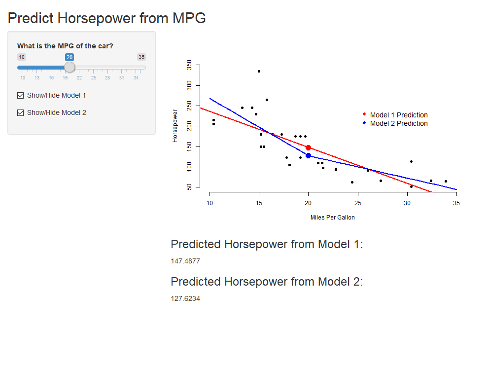

## Reactivity

A reactive expression is like a recipe that manipulates
inputs from Shiny and then returns a value. Reactivity
provides a way for your app to respond since inputs will 
change depending on how users interact with your user 
interface. Expressions wrapped by `reactive()` should be
expressions that are subject to change.

## Reactivity

Creating a reactive expression is just like creating a
function:

```r
calc_sum <- reactive({
  input$box1 + input$box2
})

# ...

calc_sum()
```

## Horsepower Prediction: ui.R Part 1

```{r, echo=FALSE}
library(webshot)
appshot("app1", "app1.png")
```

This application predicts the horsepower of a car given
the fuel efficiency in miles per gallon for the car.

```r
library(shiny)
shinyUI(fluidPage(
  titlePanel("Predict Horsepower from MPG"),
  sidebarLayout(
    sidebarPanel(
      sliderInput("sliderMPG", "What is the MPG of the car?", 10, 35, value = 20),
      checkboxInput("showModel1", "Show/Hide Model 1", value = TRUE),
      checkboxInput("showModel2", "Show/Hide Model 2", value = TRUE)
    ),
# ...
```

## Horsepower Prediction: ui.R Part 2

```r
# ...
    mainPanel(
      plotOutput("plot1"),
      h3("Predicted Horsepower from Model 1:"),
      textOutput("pred1"),
      h3("Predicted Horsepower from Model 2:"),
      textOutput("pred2")
    )
  )
))
```

## Horsepower Prediction: server.R Part 1

```r
library(shiny)
shinyServer(function(input, output) {
  mtcars$mpgsp <- ifelse(mtcars$mpg - 20 > 0, mtcars$mpg - 20, 0)
  model1 <- lm(hp ~ mpg, data = mtcars)
  model2 <- lm(hp ~ mpgsp + mpg, data = mtcars)
  
  model1pred <- reactive({
    mpgInput <- input$sliderMPG
    predict(model1, newdata = data.frame(mpg = mpgInput))
  })
  
  model2pred <- reactive({
    mpgInput <- input$sliderMPG
    predict(model2, newdata = 
              data.frame(mpg = mpgInput,
                         mpgsp = ifelse(mpgInput - 20 > 0,
                                        mpgInput - 20, 0)))
  })
```

## Horsepower Prediction: server.R Part 2

```r
  output$plot1 <- renderPlot({
    mpgInput <- input$sliderMPG
    
    plot(mtcars$mpg, mtcars$hp, xlab = "Miles Per Gallon", 
         ylab = "Horsepower", bty = "n", pch = 16,
         xlim = c(10, 35), ylim = c(50, 350))
    if(input$showModel1){
      abline(model1, col = "red", lwd = 2)
    }
    if(input$showModel2){
      model2lines <- predict(model2, newdata = data.frame(
        mpg = 10:35, mpgsp = ifelse(10:35 - 20 > 0, 10:35 - 20, 0)
      ))
      lines(10:35, model2lines, col = "blue", lwd = 2)
    }
```

## Horsepower Prediction: server.R Part 3

```r
  legend(25, 250, c("Model 1 Prediction", "Model 2 Prediction"), pch = 16, 
           col = c("red", "blue"), bty = "n", cex = 1.2)
    points(mpgInput, model1pred(), col = "red", pch = 16, cex = 2)
    points(mpgInput, model2pred(), col = "blue", pch = 16, cex = 2)
  })
  
  output$pred1 <- renderText({
    model1pred()
  })
  
  output$pred2 <- renderText({
    model2pred()
  })
})
```

## Horsepower Prediction

